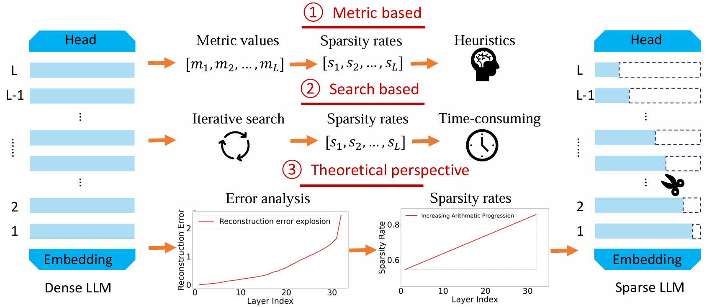

[Determining Layer-wise Sparsity for Large Language Models Through a Theoretical Perspective](https://openreview.net/pdf?id=otNB7BzsiR)

Pytorch implementation of our paper accepted by ICML 2025 (Spotlight) -- **ATP** (Determining Layer-wise Sparsity for Large Language Models Through **A** **T**heoretical **P**erspective).
<p align="center">
  
</p>

## Abstract

In this paper, we address the challenge of determining the layer-wise sparsity rates of large language models (LLMs) through a theoretical perspective. Specifically, we identify a critical issue of **''reconstruction error explosion''** in existing LLMs sparsification methods. This refers to the cumulative effect of reconstruction errors throughout the sparsification process, where errors from earlier layers propagate and amplify in subsequent layers. As a result, the overall reconstruction error increases significantly, leading to a substantial degradation in model performance. Through theoretical analysis, we derive a simple yet effective approach to layer-wise sparsity allocation that mitigates this issue. Our method uses a monotonically increasing arithmetic progression, reducing the process of determining sparsity rates for multiple layers to the determination of a single common difference hyperparameter. Remarkably, this allows for the optimal layer-wise sparsity rates to be identified with just a few trials. Both our theoretical analysis and experimental results demonstrate that this sparsity allocation scheme is near optimal.
Extensive experiments show that our method significantly improves the performance of sparse LLMs across various architectures, outperforming existing layer-wise sparsity methods. Furthermore, it enhances the performance of various compression techniques and is applicable to vision and multimodal models. Notably, our method achieves a reduction of 52.10 in perplexity for the 70% sparse LLaMA2-7B model obtained via Wanda, improves average zero-shot accuracy by 10.50%, and delivers speedups of 2.63 $\times$ and 2.23 $\times$ on CPU and GPU, respectively.

## Setup

Installation instructions can be found in [INSTALL.md](INSTALL.md).

## Usage
You can directly search for the optimal non-uniform sparsity rate configuration by running `bash search.sh`. Additionally, you can modify the hyperparameters in lines 22–25 of [search.sh](search.sh) as follows:
```sh
python main.py \
    --model meta-llama/Llama-2-7b \
    --prune_method wanda \
    --sparsity_ratio 0.7
```
We provide a quick overview of the arguments:  
- `--model`: The identifier for the LLaMA model on the Hugging Face model hub.
- `--prune_method`: We have implemented two popular LLM sparsity methods which can be combined with ATP, you can choose [`wanda`, `sparsegpt`].
- `--sparsity_ratio`: Indicates the percentage of weights to be pruned.

After running the above script, the best $\beta$ value in ATP as well as the best sparse LLM perplexity will be printed.
## Zero-Shot Evaluation
Following [Wanda](https://github.com/locuslab/wanda), we use the modified EleutherAI LM Harness framework to evaluate pruned LLM models. We provide the modified repo in this [link](https://drive.google.com/drive/folders/1-izPsaOAiatn6YJYGQD_PlzfPIdBoLBI?usp=drive_link). Make sure to download, extract and install this custom lm_eval package from the source code.

On a high level, the functionality is adding two arguments `pretrained_model` and `tokenizer` in this [function](https://github.com/EleutherAI/lm-evaluation-harness/blob/master/lm_eval/evaluator.py#L17). We can then call this `simple_evaluate` function API from the codebase to evaluate sparse pruned LLMs. To evaluate zero-shot tasks in addition to the WikiText perplexity, pass the --eval_zero_shot argument in the script, you can run the script like this:
```sh
export CUDA_VISIBLE_DEVICES=0

python main.py \
    --model meta-llama/Llama-2-7b \
    --prune_method wanda \
    --sparsity_ratio 0.7 \
    --beta `(The optimal beta found by running bash search.sh)` \
    --eval_zero_shot
```

## Speedup Evaluation
### CPU
We evaluate CPU acceleration using DeepSparse CPU inference engine.

**Step1: install relevant packages [sparseml](https://github.com/neuralmagic/sparseml) and [deepsparse](https://github.com/neuralmagic/deepsparse)**

**Step2: create sparse model checkpoint, and save to model_path**

**Step3: export the sparse checkpoint to ONNX format**
```
sparseml.export --task text-generation model_path
```

**Step4: evaluate using deepsparse**
```
deepsparse.benchmark model_path/deployment/model.onnx --sequence_length 2048
```
### GPU
We evaluate GPU acceleration using nm-vllm GPU inference engine.

**Step1: install relevant packages [nm-vllm](https://github.com/neuralmagic/nm-vllm)**

**Step2: create sparse model checkpoint, and save to model_path**

**Step3: generate outputs with nm-vllm**
```
from vllm import LLM, SamplingParams
# Example prompt.
prompts =["What is large language model?"]
# Load sparse LLM from model_path.
llm = LLM(model_path, sparsity="sparse_w16a16")
# Generate text from the prompt.
sampling_params = SamplingParams(max_tokens=128)
outputs = llm.generate(prompts, sampling_params=sampling_params)
```

## Related Project

[A Simple and Effective Pruning Approach for Large Language Models](https://github.com/locuslab/wanda)

[SparseGPT: Massive Language Models Can be Accurately Pruned in One-Shot](https://github.com/ist-daslab/sparsegpt)

[Outlier Weighed Layerwise Sparsity (OWL): A Missing Secret Sauce for Pruning LLMs to High Sparsity](https://github.com/luuyin/OWL)

[AlphaPruning: Using Heavy-Tailed Self Regularization Theory for Improved Layer-wise Pruning of Large Language Models](https://github.com/haiquanlu/AlphaPruning)

## Citation

if you find this repo is helpful, please cite our paper:
```
@inproceedings{
huang2025determining,
title={Determining Layer-wise Sparsity for Large Language Models Through a Theoretical Perspective},
author={Weizhong Huang and Yuxin Zhang and Xiawu Zheng and Fei Chao and Rongrong Ji},
booktitle={Forty-second International Conference on Machine Learning},
year={2025},
url={https://openreview.net/forum?id=otNB7BzsiR}
}
```
